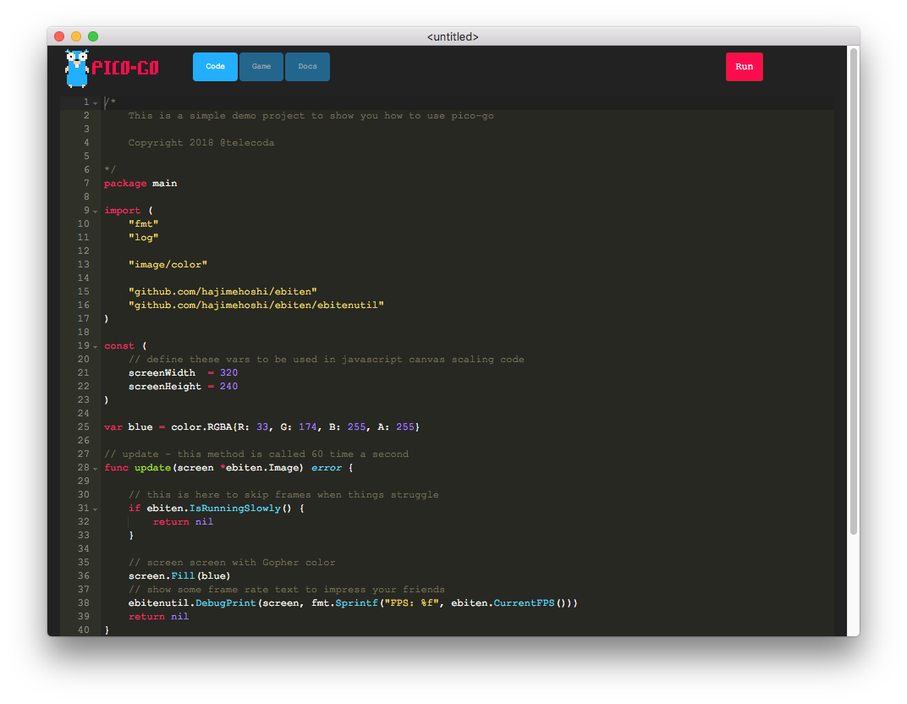
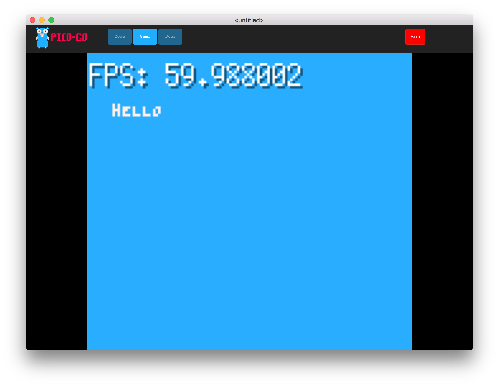
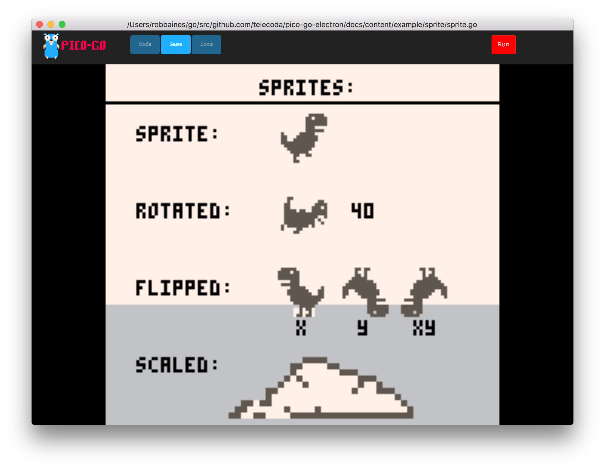

# pico-go-electron

pigo-go is a standalone (offline) gamedev tool using Go.  It is for developing simple games / demos like the [pico8 console](https://www.lexaloffle.com/pico-8.php) but instead of coding in Lua you use Go.

# Installation

To get started follow the installation instructions [here.](./INSTALL.md)

# Getting started

Once you have built and run pico-go you'll be presented with a fairly empty code editor window.

Select `New` from the file menu or press `CMD+N` and the editor will be filled with a _very_ simple program file.

Click `run` and the code will be compiled and the window will change to an awe-inspiring game window.

## What actually happens

When you hit `run` the Go code this is what happens:

- the code is copied from the editor and sent to the backend in a temporary folder
- the demo project is a simple `ebiten` based demo  
- one of the coolest features of `ebiten` is that it can compile to javascript
- GopherJS is used to compile the Go code into Javascript
- if there are any compilation errors these will be highlighted in the code editor against the corresponding source lines
- if there are no errors the resulting javascript file is copied to a location that keeps the Electron app happy (this differs for Windows & OSX grrrr...)
- the Electron app is reloaded and displays the `game` iFrame
- there is a little javascript jiggery pokery on the page to hijack adding event listeners
- don't worry about this bit, it's just so we can use our own canvas resizing code instead of the resize code generated by `ebiten`
- All being well you have a blue screen (not of death) showing a FPS framecounter and you can happily resize the window to your hearts content
- Now the fun begins and you start coding something for real

# Next steps

Head on over to the development guide and get started writing your own games and demos.

[developer guide](./docs/content/dev%20doc/_index.md)

Or if your are looking for inspiration check out the [examples](./docs/content/example)

# Benchmarks

There are a few benchmarks in here which have helped me pinpoint (and hopefully improve) cpu or memory intensive code.  If you'd like to run them:

    go test -benchmem -run=^$ github.com/telecoda/pico-go-electron/console -bench ^Benchmark

# History
Find a little about the background of this project [here](./docs/content/about/history.md)

# Standing on the shoulders of giants

This project has been made possible by a number of awesome open source projects.

## ace.js
https://github.com/ajaxorg/ace

Ace is a standalone code editor written in JavaScript.
## Ebiten
https://hajimehoshi.github.io/ebiten/

A dead simple 2D game library in Go
## Electron
https://electronjs.org/

Build cross platform desktop apps with JavaScript, HTML, and CSS

## hugo
https://gohugo.io/

Static site generator. Transforms markdown files into the embedded docs inside pico-go

### hugo theme docDock

https://themes.gohugo.io/docdock/

## go-astilecton
https://github.com/asticode/go-astilectron

Build cross platform GUI apps with GO and HTML/JS/CSS (powered by Electron)
## GopherJS
https://github.com/gopherjs/gopherjs

GopherJS compiles Go code (golang.org) to pure JavaScript code.

